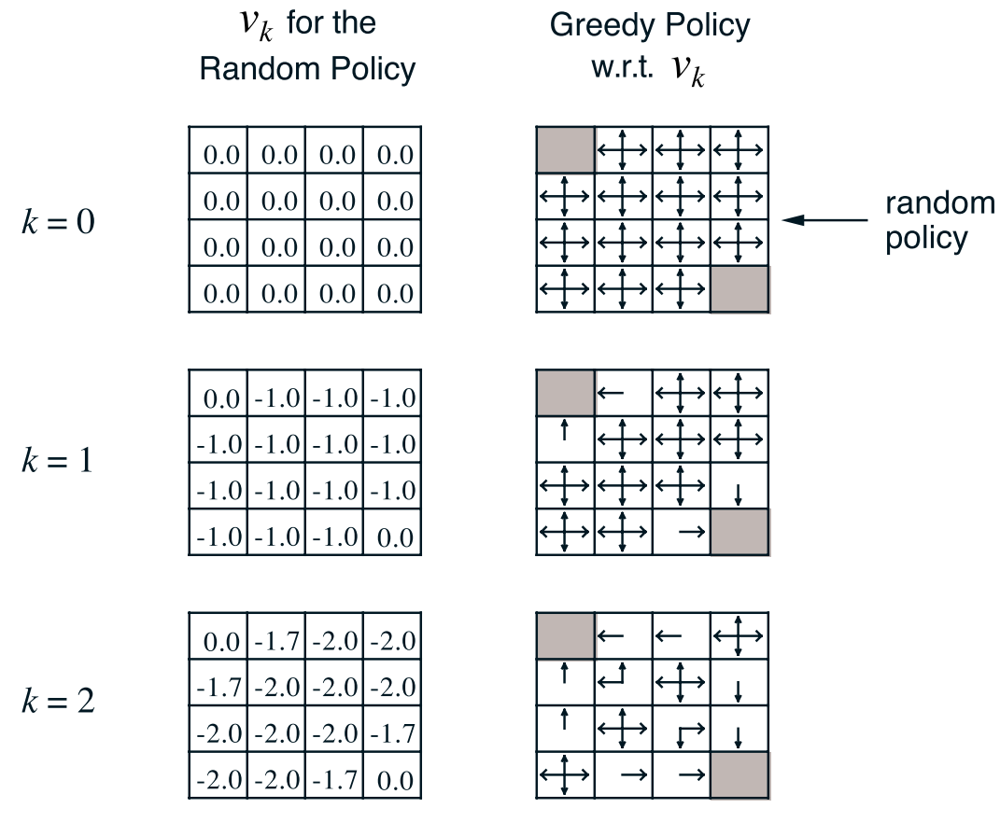

# Lecture 3: Dynamic Programming

#### Properties

- optimal substructure: 
  - prinicipal of optimality: we can decompose problem into sub-problem and their solutions
- overlapping sub-problems: 
  - recurrence of sub-poblem
  - can be cached and reused

MDP satidfies both the properties:

 - bellman equation gives recursive decomposition
 - value fucntion stores and reuses solutions

### Planning problem

#### Prediction:

How much reward you get from a given policy

- Input: $MDP(S, A, P, R, \gamma)$ and $\pi$

  ​	   $MRP(S, P^\pi, R^\pi, \gamma)$

- Output: value function $v_\pi$
- Iterative policy evaluation: bellman expectation equation + Iterative evaluation 

#### Control:

How to find the optimal policy $v_*$

- Input: $MDP(S,A,P, R, \gamma)$
- Output: optimal value function $v_*$ and optimal policy $\pi_*$
- Policy Iteration: Bellman expectation equation + Greedy policy improvement
- Value Iteration: Bellman optimality equation

## Policy Evaluation

- prediction problem: computing state-value function $v_{\pi}$ for an arbitary policy $\pi$

- initial value function $v_0$ is chosen arbitarily and each successive approximation is obtained by using Bellman equation :
  $$
  v_{k+1}(s) = E_{\pi}[R_{t+1} + \gamma v_k (S_t+1) | S_t = s]
  $$

  $$
  v_{k+1} = \sum \pi(a|s) (R_s^a + \gamma \sum_{s^\prime \isin S} P^a_{ss^\prime} v_k(s^\prime)
  $$

- full backup: it replaces the old value of s with a new value obtained from the old values of the successor states of s, and the expected immediate rewards, along all the one-step transitions possible under the policy being evaluated.

### Iterative policy evaluation algorithm

>Input $\pi$, the policy to be evaluated 
>Initialize an array V(s) = 0, for all s ∈ S+ 
>Repeat 
>	∆ ← 0
>	For each s ∈ S:  
>		v ← V(s)
>		V(s) ← $\sum_a \pi(a|s) \sum_{s^\prime,r}p(s^\prime, r|s,a)[r + \gamma V(s^\prime)]$
>		∆ ← max(∆, |v −V(s)|) 
>
>until ∆ < θ (a small positive number) 
>
>Output $V ≈ v_{\pi}$

## Policy Iteration

- With the policy evaluation we know how good is it to follow the current policy $\pi$

- In order to find out if this policy is optimal we make a small change: consider selecting a different action for immediate step and then keep following existing policy. 

- Given a policy $\pi$

  - evaluate policy $\pi$
    $$
    v_\pi (s) = E[R_{t+!} + \gamma R_{t+2} +...| s_t=s]
    $$

  - Improve policy by actiing greedily with respect to $v_\pi$

    $\pi^\prime = greedy(v_\pi)$

- consider a deterministic policy: $a = \pi(s)$

- can improve policy by acting greedily: $\pi^\prime(s) = argmax_{a} q_\pi (s,a)$

- pick action which maximises $q_\pi$

- this improves value from any state 's' over one step

- $q_{\pi}(s, \pi^\prime (s)) = max_{a} q_{\pi} (s,a) \ge q_\pi(s, \pi(s)) = v_{\pi}(s)$

- if we take $\pi^\prime$ for one step and then follow $\pi$ afterwards

- max over all the action will be atleast better than any one  

- value function improves for atleast one step

- taking a greedy policy for one step is better than using current policy

- if improvements stop then the bellman optimality equation is satisfied

  $q_{\pi}(s, \pi^\prime (s)) = max_{a} q_{\pi} (s,a) = q_\pi(s, \pi(s)) = v_{\pi}(s)$

  $v_\pi (s) = max_a q_\pi (s,a)$

  $v_\pi (s) = v_* (s)$

## Value Iteration

- Value iteration is a way to truncate policy evaluation step to just one sweep. 

- It combines both the policy improvement and truncated policy evaluation in one step:
  $$
  v_{k+1} = max_{a}E[R_{t+1} + \gamma v_{k}(s_{t+1})| S_t=s, a_t=a ]
  $$

  $$
  v_*(s) = max (R^a_s + \gamma \sum P^a_{ss^\prime} V_{*}(s^\prime))
  $$

- value iteration is applying these updates iteratively

- Intuition: define a final reward and work backwards to the solutiion. System doesn't know about final states

- Problem: find optimal policy $\pi$

- Solution: iterative application of bellman optimality equation backup

- intermediate value function may not correspond to any policy

### Extensions to Dynamic Programming

#### Inplace Dynamic Programming

- done use two seperate new and old variable for value function
- store only one copy and use the most recently updated value
- but the order of selection of states to be updated affects the solution  so we need...

#### Prioritized Sweeping

- come up with a measure to prioritize the states to be updated and rank them with their importance values

- The states which are changing the most are more important because it is going to effect others

- use magnitude of bellman error (change in bellman equation) to guide state solution
  $$
  |max (R^a_s + \gamma \sum_{s^\prime \isin S} P^a_{ss^\prime} V(s^\prime)) - V(s)|
  $$

  - backup the state with largest remaining bellman error
  - update bellman error
  - maintain a priority queue

#### Real time dynamic programming

- select the states that are relevant to agent
- use agent's experience to guide solution of states

## Conclusion

- DP uses full width backups; computations over all states and actions which is expensive. 
- need to know dynamics of the system; not possible for huge problems
- one way to deal with this is to use sampling of backups to deal with curse of dimensionality. This is where we start discussion about model free RL